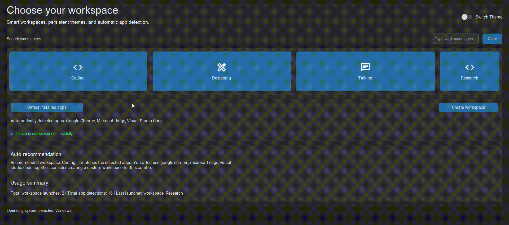
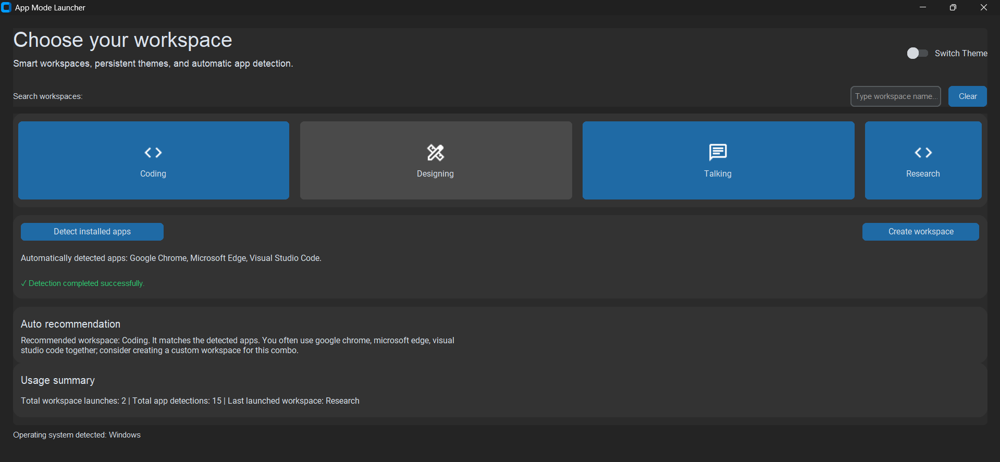

# App Mode Launcher


[](https://www.python.org/)
[](LICENSE)
[](#)
[](#)

## Launch smarter. Focus faster.

**App Mode Launcher** is an intelligent desktop workspace manager for developers, students, and gamers.
It instantly launches personalized app groups, workflows, and recommended workspaces in a single click.

---

## Demo



## What it does

App Mode Launcher is a productivity-focused desktop application that helps users instantly launch personalized workspaces, apps, and workflows.

- Intelligent workspace system powered by local analytics.
- Cross-platform app detection and recommendation suggestions.
- Persistent theme and startup configuration.
- Simple JSON-based workspace authoring.

---

## Features

- Intelligent workspace system
- Cross-platform app detection
- Persistent themes and startup presets
- Workspace recommendations
- CustomTkinter modern UI
- Dynamic workspace loading from JSON
- Local analytics with zero-state persistence
- Plugin hooks and modular extension support
- Logging system for traceability
- Automated tests and type-safe Python code

---

## Before vs After

| Before | After |
|---|---|
| Monolithic utility | Modular architecture |
| Basic single-launch launcher | Intelligent workspace manager |
| No persistence | Persistent configuration |
| No workspace intelligence | Analytics-driven recommendations |
| Limited UX | Modern CustomTkinter UI |
| No plugin extension | Plugin system for custom workspaces |
| No dedicated docs | Product-ready README + roadmap |

---

## How GitHub Copilot Helped

- Assisted modular refactoring to organize `app/core`, `app/ui`, `app/plugins`, and `app/tests`
- Helped structure the logging and analytics subsystems
- Accelerated UI improvements and status feedback design
- Suggested type hints, validation, and safer config handling
- Improved productivity during debugging and README refresh

---

## Architecture

```
app/
├── core/            # Business logic and analytics
├── ui/              # CustomTkinter interface components
├── config/          # Persistent JSON settings and runtime analytics
├── plugins/         # Plugin discovery and hook integration
└── tests/           # Automated pytest coverage
```

This architecture keeps the launcher modular, testable, and ready for extension.

---

## Installation

```bash
git clone https://github.com/felipe-f-rocha/app-mode-launcher.git
cd app-mode-launcher
python -m venv .venv
source .venv/bin/activate
pip install -r requirements.txt
python main.py
```

On Windows:

```powershell
python -m venv .venv
.\.venv\Scripts\activate
pip install -r requirements.txt
python main.py
```

---

## Technologies

- Python 3.12
- CustomTkinter
- Pillow
- JSON configuration
- Pytest
- Logging
- GitHub Copilot

---

## Roadmap

- Plugin system and third-party workspace extensions
- AI-powered recommendations
- Cloud sync for workspace settings
- Analytics dashboard
- Workspace sharing and templates

---

## Screenshots



---

## Final Vision

From a simple launcher utility to an intelligent productivity workspace manager.

App Mode Launcher is designed to feel polished, fast, and modern while keeping configuration simple and extensible.

---

## License

MIT License
